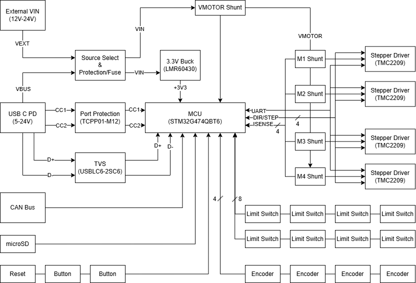

---

> 🚧 Under development

Stepping Stone is a 4-axis stepper motor control platform designed for robotics and CNC development. Built around an STM32 MCU and TMC2209 drivers, it supports coordinated multi-axis motion, encoder feedback, stall-sense homing, and CAN/USB connectivity for flexible development and testing.

Designed as a “stepping stone” in motion-control prototyping, it bridges the gap between simple stepper driver breakouts and full CNC or robotics systems, providing a reusable platform for early development.

## Block Diagram

### Navigate

| |  |  |
|-----------|---------|---------|
| **[Hardware](./hardware/README.md)** | Circuit design and PCB layout | KiCad design files, simulations |
| **[Firmware](./firmware/README.md)** | Microcontroller implementation | STM32 code, CubeMX configuration |
| **[Software](./software/README.md)** | Desktop control interface | JavaFX GUI application code |

## Target Capabilities

- **Power Input**: USB-C PD and external motor power support.
- **Motors**: 4 independent stepper motor channels.
- **Encoders**: 4 quadrature encoder channels.
- **Limits**: 8 limit switch channels and stall-detection support.
- **Safety**: E-Stop support and motor-disable capability.
- **Connectivity**: USB 2.0, CAN, I2C, SPI, UART, and GPIO interfaces.
- **Storage**: microSD support for G-code storage and system logging.
- **User Interface**: Status LEDs, reset button, and user-programmable buttons.

## Roadmap

- [ ] System architecture defined
- [ ] Component selection finalized
- [ ] Schematic capture
- [ ] PCB layout
- [ ] Firmware development
- [ ] Software development

See the [open issues](https://github.com/jacob-wigent/stepping-stone/issues) for a full list of proposed features (and known issues).

## Tools
- **Hardware Design:** KiCad 10.0 for schematic capture and PCB layout
- **Firmware:** STM32CubeIDE or PlatformIO (planned)
- **Software:** JavaFX for desktop control interface and [rerun](https://github.com/rerun-io/rerun) bridge for visualization (planned)

## License

This project is released under the **CERN Open Hardware Licence Version 2 – Strongly Reciprocal (CERN-OHL-S v2)**.  

You are free to use, modify, and distribute the hardware and design files, provided that derivative works are also shared under the same license.  

For full license details, see the [LICENSE](LICENSE) file.
